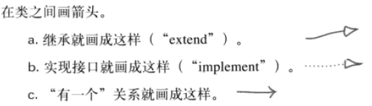

# BJ客戶端框架

## 問題
1. 我如何才能正確打開這個框架
   1. 給到的trunk到底是游戲工程還是什麽？如何正確打開並使VS正確管理Project從而可以使用自動補全、符號查找之類
2. 导出框架有问题
   1. 因为这已经是ok的项目了

## 配置介紹
1. List的設定爲什麽會有不同：
   1. 複雜的那種難道是就地定義了一個類型？
      1. 对
   2. 簡單的那個就不是就地定義的而是用的別人的？
      1. 对，可以这么理解
2. Name本身是標記的基礎文字所以會被標記為null不需要（12:00）
3. 這些表之間的關係需要瞭解一下 
4. ST(string table)表是干嘛的，多语言翻译是怎么实现的
   1. 首先多语言那一行如果需要翻译，会在该类型中定义一个新的字段，这个字段会被其他的表中的数据给填充
   2. 这个其他的表，就是ST_（语言代号）.xlsl表，每个需要翻译的列后面都会跟一列标注该字段在ST表中的ID的列。根据ID直接上对应语言的ST表查就可以查得到那个翻译
   
### 记忆
#### 枚举表
1. 枚举还是数据看单元格`A2`
2. Data表的第11行是默认值
   1. 第7-11行是list才用
   2. LIST的那种复杂定义形式实际上是就地定义了一个class
3. NONE导出类型是供参考的（比如说明）
4. 数据准备过程
   1. 配置文件分析工具将配置文件生成为两个部分：Code和Data
      1. Code是类型定义orEnum
      2. Data是包含实际数据的bin文件
   2. Unity中BlackJack——Framework——ConfigData——BuildAll会把bin文件拷贝到Assets/Gameproject/RuntimeAssets/ConfigData
      1. 并且Unity会将bin转换成.asset（就是SO），其中保存了bin文件的数据。
         1. 应该是包了一层，用于使Unity可以以二进制数据的方式加载他  
   3. 然后二进制数据加载到内存中，才会有Protobuff反序列化生成真实数据
   4. **然后这些数据可以通过ID来获取（啊？啥的ID，啊，不是那个ST的ID虽然可能那个也可），也就是一次获取数据的一行？那这个ID从哪获取？**
      1. 哦，其实文件里也是分了类的，比如GetConfigDataCharChipSlotInfo()实际上只是从一个单独的存储了CharChipSlot信息的表里查找某个ID的数据而已 

#### 配置导出和生成到项目的过程
1. protobuf导出了类定义（结构）和bin文件（数据，每个sheet一个）
2. bin要用那个插件变成asset，路径如上
3. `ConfigDataLoaderBase`用于读取并反序列化数据
4. Asset文件有了，数据如何获取？
   1. ? 第一步从Asset中解出来二进制数据的过程需要再看一看，可能在基类里面
   2. `ClientConfigDataLoader.StartInitializeFromAsset()`中给了整个加载的过程
   3. `ClientConfigDataLoadAutoGen`给了所有的定义的类型（sheet）的反序列化获取数据的办法
      1. 也是几重回调，都是在OnEnd的时候处理下一步：
         1. 加载数据
         2. 在`OnInitLoadFromAssetEndWorker`回调中对各种类型的数据（真的茫茫多）进行反序列化并填充数据Dic
5. 多语言是如何被处理的？
   1. 在`GameManager.StartLoadConfigData`函数中有三重回调，都是OnEnd时回调，分别加载
      1. 配置数据
      2. ST数据
      3. 逻辑层扩展数据
   2. 这时ST数据就可以得到加载估计也可以得到使用了
##### 问题
1. Lazy加载都加载啥？如何Lazy加载
   1. 很简单，Lazy和非Lazy走的不是一条线，Lazy在AutoGen中就是那些ST表，有个`GetAllLazyLoadConfigDataAssetPath()`得到所有
   2. 然后在多语言的InitStringTable的时候有个SetLocalization()，这里会调用对应的InitGDBStringTable()之类的ST，这里会调用LoadLazyLoadConfigDataAsset()并传入对应的Name。
2. *LuaDummy是啥*
3. 那么`StartLoadConfigData()`这个最主要的玩意什么时候被调用？
   1. 在GameLauncher的Entry的Start-UpdatePipeline里
   2. 也就是说起始会有Start一个Entry（UI）的Pipline，这里会调用所有的ConfigData的load。
      1. 其实有点奇怪，为什是一个UITask去调用这个显然是逻辑的ConfigData的load

## 资源管理
1. 什么是`WeakReference`——并不增加引用计数，仍然可以被GC `Reclaim()`
2. Bundle和SingleBundle的关系
3. 自动绑定是什么，怎么实现的
   1. 就是创建的时候自动挂载节点
4. 关于Bundle的缓存?
   1. bundle缓存是BundleName到BundleCacheItem的映射
   2. 后者保存了Bundle的强引用
   3. Bundle加入缓存的时候是在LoadBundle中进入的（看来这个不可控啊）
5. 从物品路径查到到底是哪个Bundle是怎么实现的？
   1. Entry会在开始的时候从网上更新所有的Bundle数据，这个数据中包含资源到SingleBundleData的映射
   2. 这个数据会被存储到RM中在需要使用的时候被调用；
6. Editor状态的Load没有实现

### 记忆
1. 一般实机上使用的是AssetBundle的加载方式
2. LoadAsset()传入的资源路径是自Assets起
   1. ResourceManager中有Cache（<string, AssetCacheItem>），cache中引用资源的是弱引用
   2. 
3. LoadAssetsCorutine()就是加载一组资源，串行的方式
4. 从Bundle中Load就是先查path在哪个bundle，没有就把它下下来先，然后通过加载现场去加载所有的依赖Bundle
5. 整个流程就是缓存直接-缓存Bundle-Bundle下载这个样子。
6. BundleData里面的version从哪拿到的？玩家怎么知道version变化的？
   1. **他似乎说了一个三打不溜什么剋使的地址指定新的版本号**

### 问题
1. `LoadAssetCoroutine()`里有一个模式不理解：
   ```CSharp
   // 加载资源
   UnityEngine.Object asset = null;
   var iter = LoadAsset<UnityEngine.Object>(path, (lpath, lasset) => { asset = lasset; }, loadAsync);
   while (iter.MoveNext())
   {
      yield return null;
   }
   ```
   1. `MoveNext()`函数在成功Move的时候会返回`true`，失败的时候返回`false`
   2. 然后我们就看那个iter到底是什么
      ```CSharp
      ```
   3. 先搁置，看看Coroutine的意思是什么 [来源](https://stackoverflow.com/questions/12932306/how-does-startcoroutine-yield-return-pattern-really-work-in-unity)
      1. 用途：可以用于多帧的处理（将任务分成chunks），例如A*中一帧只找一部分路径
      2. 要求：需要在每次返回的时候记录状态，如果自己维护，成本将非常高
      3. 开始猜测Unity Coroutine的关键点：
         1. `return` 一个 `IEnumerator`
         2. `yield`
            1. 这个东西在C#里有支持，就是"When a yield return statement is reached in the iterator method, *expression is returned*, and *the current location in code is retained*. *Execution is restarted from that location the next time that the iterator function is called*."
            2. `yield`的实现逻辑 [来源](https://www.cnblogs.com/blueberryzzz/p/8678700.html)
               1. 那个函数展成一个类，类里面保存了所有的局部状态，就和lambda是一样的
               2. 然后那个类的核心是实现了IEnumerator接口的`bool MoveNext()`，这个函数内部有一个state的int，每次MoveNext都会+1
               3. 每次就根据这个state来采用Switch函数跳转到对应的chunk
               4. 而回传`IEnumerator`的不能够使用`foreach`，`foreach`需要一个`IEnumerable`
               5. `yield return` 的内容直接ignore就好了
               6. 所以做简单的分层事务，只需要简单地：
               ```CSharp
                  IEnumerator e = TellMeASecret();
                  while(e.MoveNext()) { }
               ```
                  1. 而进阶的方式，则是"Mix it in with other work"
                  ```CSharp
                  IEnumerator e = TellMeASecret();
                  while(e.MoveNext()) 
                  { 
                    // If they press 'Escape', skip the cutscene
                    if(Input.GetKeyDown(KeyCode.Escape)) { break; }
                  }
                  ```
      4. 最终Unity如何处理帧之间的rotuine的，一个可能的结构是：
         ```CSharp
         List<IEnumerator> unblockedCoroutines;
         List<IEnumerator> shouldRunNextFrame;
         List<IEnumerator> shouldRunAtEndOfFrame;
         SortedList<float, IEnumerator> shouldRunAfterTimes;

         foreach(IEnumerator coroutine in unblockedCoroutines)
         {
             if(!coroutine.MoveNext())
                 // This coroutine has finished
                 continue;

             if(!coroutine.Current is YieldInstruction)
             {
                 // This coroutine yielded null, or some other value we don't understand; run it next frame.
                 shouldRunNextFrame.Add(coroutine);
                 continue;
             }

             if(coroutine.Current is WaitForSeconds)
             {
                 WaitForSeconds wait = (WaitForSeconds)coroutine.Current;
                 shouldRunAfterTimes.Add(Time.time + wait.duration, coroutine);
             }
             else if(coroutine.Current is WaitForEndOfFrame)
             {
                 shouldRunAtEndOfFrame.Add(coroutine);
             }
             else /* similar stuff for other YieldInstruction subtypes */
         }

         unblockedCoroutines = shouldRunNextFrame;
         // 然后在别的位置就按照条件分门别类地调用他们即可
         ```
         核心就是把这些IEnumerator分门别类地存起来（触发时机+协程IEnumerator）分别进行调用，然后在触发时候就调用他们即可
            1. 注意这里根据了Current进行分类的
      5. 最终，最初的模式：
         1. 目的：实现Coroutine的嵌套
         2. 方法：在能`MoveNext()`（意味着*被调函数*完成了一部分工作到了null，被调函数使用`yield return null`暗示了它需要冷静一个frame）的时候，为了保持任何函数在Unity中出现`yield return null`的一致逻辑，主调函数也向上抛出一个`yield return null`
2. 让我们继续看看`LoadAsset()`函数
   1. 首先是一个`AssetCacheItem`
      ```CSharp
      protected class AssetCacheItem
        {
            public string m_cacheKey;
            public WeakReference m_weakRefrence;
            public bool m_removeReserveOnHit;
        }
      ```
   2. 然后是`goto`，C#中说明了这玩意只能跳转到某个Label:
      1. 可以是`switch`中的label:`goto case 1`
      2. 可以是自定义的label，仅仅是另起一行加冒号`LB_LOADEND:`
      3. 为什么回调的参数前面会加l?
   3. `BundleCacheItem`干嘛用的，命中指的是什么？
      ```CSharp
      protected class BundleCacheItem
        {
            public void AddRefrence()
            {
                m_refCount++;
            }
            public void RemoveRefrence()
            {
                m_refCount--;
            }

            public string m_bundleName;
            public DateTime m_lastTouchTime;     // 上一次的访问时间
            public DateTime m_timeOutTime;       // 过期时间
            public int m_hitCount;                      // 命中次数
            public int m_refCount;                      // 被依赖引用的次数
            public AssetBundle m_bundle;                // 被缓存的bundle
            public bool m_dontUnload;                   // 是否被设置为不需要卸载

            /// <summary>
            /// 依赖项
            /// </summary>
            public List<BundleCacheItem> m_dependBundleCacheList;

            /// <summary>
            /// 有效命中间隔时间，当有效命中的时候延长生命周期, 避免某个界面的atlas的生命周期提升太快
            /// </summary>
            public static float s_validedHitInterval = 1f;
            /// <summary>
            /// 超时时间
            /// </summary>
            public static int m_firstTimeOut = 10 * 60;
            public static int m_OnHitTimeOutDelay = 60;
        }
      ```
      1. 这个玩意和`AssetCacheItem`差别是啥
      2. 它怎么存：
         1. 跟AssetCacheItem一致，都是由一个Dic来管理
      3. 先看它怎么用吧：
         1. 从AssetPath可以拿到所在Bundle的`SingleBundleData`，根据这个可以得到Bundle名字：
            1. `SingleBundleData`有：
               1. 两个版本号
               2. 包含的资源列表(path)
               3. 各种校验变量
               4. 其他设定
         2. 之后用名字可以从GetAssetBundleFromCache拿到`BundleCacheItem`进而拿到Bundle
         3. 然后就从里面拿Asset就好了
         4. 就没了
      4. 其实看结构就几个东西：
         1. 首先是核心的AssetBundle和Dependencies;
         2. 然后就是一些跟访问有关的状态变量：引用计数、上次访问的时间、命中次数等
         3. 最后的最后就是一些设定如超时时间
   4. 加载Bundle的时候也有一个模式，就是`OnComplete`的回调
      1. 例如在LoadAssetXXX函数体内看不到的“加入缓存”逻辑链在`OnComplete`回调中，最后在LoadAsset函数中调用`PushAssetToCache`加入缓存中
         1. 这个`PushAssetToCache()`会存储`BundleCache`和`AssetCache`
   5. 加载现场
      1. 前置条件：Unity的下载管理器在一次只允许一个下载请求（no，应该是*同一个bundle只允许一个*）
      2. 机制：如果当前bundle的加载现场已经在运行则当前新的加载现场不进行操作等待当前现场完成，如果完成了则会直接`OnCompltete()`回到调用者。
         1. 其中`yield break;`会直接让这次的Enumerator come to an end
      3. 
   6. 可以弄一下Bundle的打包和加载流程
         
      
#### 自动绑定
1. 实际上我自己就在做这个事，只不过我的绑定对象的路径是直接写在逻辑里了的，而这里是通过给一个变量一个带路径的attribute，将这个路径的物件直接绑给这个变量（这个可以实现一波）
2. `PrefabControllerCreator`就是将某个Controller动态创建至某个Prefab的机制（又加了一步）
   1. *为什么要用这个？*
      1. 估计是因为Controller实际有很多，并不想一个个手动绑定（毕竟Controller做的是“将节点赋值给Controller，而不是将Controller挂在Prefab上”），所以这里需要一个管理器来绑定Controller
   2. 使用方式是（一个小细节）：使用Creator的静态函数把那个对象传进去然后这个静态函数会解析上面的Controller描述（`ControllerDesc`）并绑定对应的Controller
      1. 所以这其实是个工具函数，工具函数就静态就好了
      2. `ControllerDesc`其中全部是string描述，所以controller都是用反射来创建的
3. `PrefabResouceContainer`用于实现Prefab复用
   1. 使用原因：至少2017版本中，如果Prefab A包含另一个Prefab B, 这个B的对象并不能跟随Prefab的变化而变化——此时Prefab和对象的联系已经断掉了
   2. 哦，通过只是脚本引用——而没有直接挂进去的prefab（避免断开联系而失效），来在创建时自动加载子prefab从而实现Prefab更新-Prefab的对象也更新的效果
      1. *奇怪的是，`PrefabResourceContainer`中并没有进行`Instantiate()`之类的啊？难道只是储存数据？*
4. 自动绑定的过程：
5. 试试2019的Prefab之间的关系能不能OK
   1. 现在是OK的了，尝试也尝试通过了，[这里](https://zhuanlan.zhihu.com/p/49805994)也说明了在Unity2018.3中实现了这个功能

## 场景管理
1. `SceneManager`负责管理Layer
   1. 创建Layer
      1. 创建Layer会首先在hierarchy中创建一个Dummy节点Name+`_LayerRoot`
      2. 然后根据传入的资源路径*加载资源*
      3. 资源加载完毕后会在`OnAssetLoadComplete()`中`Instantiate()`并创建之
      4. 这时Layer会进入unused列表中
   2. 销毁Layer
      1. 在Loading中则等待Loading完成
      2. 在栈中则先弹栈
      3. 销毁之
   3. PushLayer
      1. 从unused列表中出栈，并压栈`m_layerStack`中
      2. 进入合理的Root
      3. 设置脏标记用于Update Stack顺序，这个函数调用是在`Update()`中
   4. PopLayer
      1. 从m_layerStack中走，进unused
      2. 脏标记
2. 听说一个显示对象就是一个Layer
   1. 那么真的有那么多摄像机？
      1. 可能那些都是一个摄像机，毕竟还有scene的layer和3D的layer
      2. **摄像机之间都是啥关系**
3. 为什么是UI+3D+UI的结构，也就是为啥是UI在3D之下？
   1. 是这样的，就是3D+UI+3D中间的UI就是指“在3D之下”的那一层
      1. 看来3D的Layer会灵活些？为啥 no，不是，3D应该就只有一层
   2. 现在只支持两层UI中间夹3D，听起来实际完整的结构是（从下到上）：3D+UI+3D+UI(是不是还能+一层3D)
   3. Group2是下层的layer，但是层级位置比较新
4. Push（显示）和Pop（取消显示）层是从unusedRoot取出或加入
5. 叠套的绘制顺序由什么控制？
   1. 首先是`StayOnTop`
   2. 特殊的情况才用到layer的`Priority`
   3. 然后是push入栈的顺序
6. 叠套的绘制顺序由什么实现
   1. 物品摄像机的depth值
### 问题相关
`UIController`、`ListUIController`和`UITask`的作用
### 涉及脚本
* `SceneManager.cs`：管理Layer：增删改查适配特效
* `SceneLayerBase.cs`：Layer的名称、描述、状态
* `UISceneLayer.cs`：节点，相机，画布之类property
* `ThreeDSceneLayer.cs`：只有LayerCamera
* `UnitySceneLayer.cs`：继承3DSceneLayer，只是根节点列表

## 音频
1. 音频管理器如何管理挂载在prefab上的音频？还是通过场景管理器类似的去拿到GO再去管理
   1. 那统一管理呢？

## PlayerContext
1. PlayerCtx是用于在客户端缓存玩家*逻辑数据*的地方
   1. 此外还是封装了和服务器网络通信的地方
2. 前一个说法并不甚确切，PlayerCtx本身是处理协议收发，而其中包含的LogicBlock才是用于存储处理的部分
   1. 几种协议类型：
      1. `SendXXXReq`(上层事件、调用)-`OnXXXAck`(协议处理)：客户端和服务器一问一答
         1. `OnXXXAck()`函数基本逻辑：
            1. 确认请求成功==0
            2. 委托`LogicBlock`更新逻辑数据
            3. 调用`EventOnXXXAck`事件去通知UI层显示更新
      2. OnXXXNtf(协议处理)：服务器直接发起
      3. 这些协议都在`OnGameServerMessage`中被处理，而该函数则在各种`Tick`中被包含
3. PlayerContext和LogicBlock以及DataContainer、DataSection的关系
   1. 为了根据类型划分数据便于管理，PlayerContext中存储着分为不同类型的信息，这些信息就是LogicBlock。PlayerCtx中持有LogicBlock作为成员
      1. 在这个基础上，如上所述，PlayerCtx主要负责的是协议收发
   2. DataContainer是主要用于存储真正的数据的地方，也是要干一些真正的粗活比如`FindOrCreateEmpty`之类，LogicBlock更上层一些（实际上感觉就是一层封装）
   3. 至于`DataSection`用于解决的是每次更新整个DataContainer代价极大的问题，所以将所有DataContainer拆小，可以模块化更新。
      1. 比如ItemStore的DataSection就是以物品的index作为划分标准
         ```CSharp
         private class DataSectionItemStoreInfo : DataSection
         {
            // 本DS的起始index
            public Int32 m_startIndex = 0;
            // 物品信息列表
            public List<StoreItemInfo> m_itemList = new List<StoreItemInfo>();
         }
         ```
4. 所有的On事件回调都在OnServerMessage()里面被resolve
#### LogicBlock
1. 下层有两个东西：
   1. DataContainer
      1. 实际存储数据的集合，跟逻辑无关，只是一个Container
   2. DataSection
      1. DataContainer可能包含过多对象，数据块可能非常大，这个用来将Container拆分，分块更新

## UITask和UIManager   
1. 什么是Task？
   1. 客户端完成功能的集合
   2. 比如我发一个Req是非常简单的，但所有的相关逻辑：如果产生网络错误（我不通、服务器不通），还有超时等等怎么办，于使会有一个`NetworkTansactionTask`来处理所有这些问题
   3. 什么是Task的Intent
      1. 包含两个东西:
         1. Task的名称，所以Intent常常会作为句柄
         2. Task的参数Dic，用于告诉这个Task必要的信息
      2. *为什么这玩意也有个stack*
         1. 用于一层一层返回
            1. 奇怪，为什么不直接用Task的stack
               1. 如果用Task的stack才奇怪呢，因为Task只是一个方法而不是数据
2. UITask受UIManager控制
   1. 其中最关键的几个函数
      1. `StartUITask`
      2. `StartUITaskWithPrepare`
         1. 比如显示仓库之前需要从服务器拉取数据，然后才能正常显示
         2. 这个WithPrepare的Prepare方法由Task本身包含
            1. `UITaskBase.PrepareForStartOrResume()`
      3. 这里可以注册和登出Task，注册的Task保存在一个Dic种
         1. 注册主要是为了两个事：
            1. 处理Task之间的分组冲突
            2. 将Task缓存到list中用于复用
               1. Task的复用和Indent的复用好像不是一个层面上的，Indent的复用更多是一种逻辑，Task的复用更像是优化
      
3. **Task的Indent是什么**，难道是他的handle？但这里还有Name啊
   1. 感觉是参数信息，所有的参数就往里扔就对了
      1. 基类就俩string，一个taskName一个Mode，然而注意`UIIntentCustom`就对了，这里有一个`Dictionary<string, object>`
         1. 至于UIIntentReturnable就是有一个在Task1启动Task2的时候把他的UIIntent给Task2即可，但注意待返回的那个intent  一定要在stack里面
   2. 其中的string targetMode是啥玩意？
      1. 字符串反正灵活使用吧
4. UI的Register主要的作用是分组、冲突
5. prepare、redirect什么的都是用来处理接续或者同步的Task逻辑才产生的

### 涉及脚本
1. `UIManager`：创建、开始、*返回*、停止、暂停Task
2. `Task`
3. `UITaskBase`
4. `NetWorkTransactionTask`

## UITask更新管线
1. UITask所进行的几个步骤：逻辑数据获取，动态/静态资源的管理，界面刷新逻辑的控制；当然还有一些点击事件等等。
2. 界面刷新过程/`UITask`的一次管线刷新过程：显示出来到动画停止
3. 核心函数：
   1. 所有的`Task`启动、恢复、return等数据准备之后，都会调用同一个`UITaskBase.StartUpdatePipeLine()`函数
      1. 这个函数在`UITaskBase.OnStart()`中被调用，一般Task没有这个
      2. **更新数据** ``：这里才更新数据！
      3. 准备资源 ``
      4. 界面刷新 `StartUpdateView()`
         1. 界面刷新甚至从整个数据开始拉取的时候一般会禁止UI交互
         2. 如果是第一次打开，那么进行初始化工作
         3. 然后进行UI的auto bind
   2. `UITaskBase.StartUpdatePipeLine()`会调用`UpdateDataCache()`，会有疑问就是为啥这里也要处理data。
      1. 注意这里是DataCache，就是从PlayerCtx中拿到的数据可能并不符合显示需求，比如你可能需要对装备栏里的东西进行一个过滤，显示的信息是过滤后的信息
      2. 啊？艹之后就是静态资源和动态资源加载...哦资源不是数据
4. `UITask`管理若干个`UILayer`以及所属的`UIController`，负责创建并显示`Layer`，同时通过`UIController`控制`Layer`的动画过程及图片文字显示等等。
5. **事件处理函数在`InitAllUIControllers()`中绑定，可是我还没见过什么事件处理函数咧**
6. 一个认识：这个框架之所以叫“框架”，并不是库的那种你拿过来随意组合调用的各种组件，而是给你规定了流程（*什么事情在什么时候做*），你要在这个流程中的固定位置填充你自己的逻辑。真的就是“别人调用你”
7. 加载的资源分为动态资源和静态资源：
   1. 静态资源就是每一个Task拥有的Layer，会需要收集所有静态资源的描述
      1. `LayerDescArray`记录了：
         ```CSharp
         public class LayerDesc
            {
               public string m_layerName;
               public string m_layerResPath; // 美术资源路径
               public bool m_isUILayer;
               public bool m_isLazyLoad = false;
               public int m_index;
               public bool m_isReserve;   // 是否需要保留
            }
         ```
      2.  `UICtrlDescArray`记录了:
        1.  Controller绑到的layer的名称
        2.  绑定路径是什么
        3.  绑定的类型（就是那个Controller）是什么
        4.  类型的名称
   2. 动态资源就是根据逻辑数据得到的不确定的资源
   3. 至于两者的加载过程，大同小异，都是
      1. 获得所有当前待加载的资源描述
      2. 检查所有的资源描述是否合理
      3. 筛选掉已经加载过的资源，剩下需要加载的资源
      4. 加载资源
      5. 调用`OnLoadAllResourcesEnd()`
8. Task就是工作单，Manager就是执行者，Layer就是资源和材料
9.  UITaskPipelineCtx好像就是保存一些本次Update时候的状态 
   1.  但为啥要整出来这样一个叫管线现场的东西？为啥我不能直接写在这个Task里头啥的？
       1.  哦，直接写在Task的可能包含了每一次的配置和跨越不同次更新的配置？
       2.  *那么这个叫“上下文”或者“现场”似乎包含了一个模式或者说习俗，这个模式反映了怎么样的一个习俗呢？*

## 各种Manager
1. `SceneManager`用于处理Layer
2. UIManger
3. TaskManager

## PlayerCtx
1. 工作：
   1. 首先负责服务器事件处理的那个大Switch
      1. 以及以上所有内容的**数据部分**的回调处理，在这之后会派发给UI做UI处理
         1. 动力源是Client的Tick()
   2. 

## 实现的三个文件

### UITask
1. UITaskPipelineCtx中有更新掩码

### UIController


1. 数据成员：
   1. `ListUIController`
      1. 该成员用于控制中间物品展示的效果
   2. `ItemSimpleInfoUIController`
      1. 该成员用于控制右侧边栏的物品信息的显示
   3. `CommonUIStateController`
      1. 该数据成员用于控制各种颜色、状态、风格等等玩意，看来是本UI的效果/动画机，当然这个东西别的两个Controller也有
   概略来说，有两个子物体的Controller，和一个控制动画播放的Controller
2. 方法成员：
   1. `OnBindFiledsCompleted()`用于根据其他的Container来创建子物体
      1. 时机：当*自动绑定*完成后被调用，而自动绑定是在`Controller`的`Initialize()`的时候被调用的
      2. 作用：
         1. 创建ListUI
         2. 创建Item缓存
         3. 创建ItemInfoUI
   2. `GetShowItemStorePanelProcess()`
      1. `CommonUIStateEffectProcess`真的就是当前的动画播放进度，基类的State有几个值`Init`、`Started`、`End`之类
      2. 然后还包括其他的一些描述信息，和持有的UIStateController引用
   3. `GetShowItemStorePanelEffectInfo()`
      1. 返回`UIPlayingEffectInfo`，用于返回当前动画机的动画状态的描述信息
         1. 这个info是一个很简单的结构，主要的就是持有一个UIStateController和stateName，看来是管理UI动画的，那我猜这个动画应该也有个状态机，并且`UIStateController`应该是个关键结构（见前方）


### ListUIController
1. 数据成员
   1. 
2. 方法成员
   1. `Start()` 绑定所有的Toggle按下事件
   2. `OnBindFiledsCompleted()` 创建物品的模板对象
   3. `CreateItemListPool()` 初始化全局库数量及为每个物件的Controller挂载事件
3. 事件成员
   1. 所有的Toggle的切换事件绑定的是`ItemStoreUITask.OnItemListUITabChanged()`
      1. 那么我在哪里使得逻辑数据发生更新的呢？
         1. 要记得在UpdatePipeline中有更新逻辑数据的部分：`UpdateDataCache()`，这个在`ItemStoreUITask`之中有重载
4. 整体逻辑：
   1. `UpdatePipeline()`会令自己的ChangeTab函数监听Controller中的Toggle的点击事件
   2. 点击后filter将会发生改变
   3. 改变后的filter可以被用于更新逻辑数据
   4. 逻辑数据改变后加载图标
   5. 播放动画

### NetworkTransaction
1. 默认构造函数在进行Task的过程中会Block住Input

### 实现的功能及涉及
1. 点开
   1. 主要还是把父节点的StartUpdatePipeline()里面所需的调用的补齐就行了
2. 滚动
   1. 需求：使用滚轮对物品列表进行上下滚动
   2. 那个关掉会导致滚动失效的脚本里跟Update有关的函数注释掉没有停止他的滚动，所以是不是一种？事件？
      1. 妈的真的是，`LoopScrollRect.OnScroll()`完全就是Unity的事件函数
3. Toggle
   1. 需求：点击Toggle进行相应的物品筛选及显示
   2. 逻辑：在`ItemStoreListUIController.Start()`中对所有事件进行绑定
      1. 那么如何实现的自动互斥呢？
         1. 所有的OnXXXChanged函数中都会调用一个Event，这个Event是由ItemStoreUITask把`ItemStoreUITask.OnItemListUITabChanged()`绑定的
         2. 在`OnItemListUITabChanged()`中会设定当前的`ItemListType`，然后在`UpdateDataCache()`中会根据之设定filter（同上一节）
   3. 物件的自动绑定：在`ItemStoreListUIController`的property中对`GameObject`进行自动绑定
4. 详情
   1. 需求：点击Item跳出相应Item的详情页
   2. 逻辑：
      1. `ItemStoreListUIController.OnItemStoreUIItemClick()`会被调用
      2. 这个函数放在`ItemStoreListUIController.CreateItemListPool()`中被绑定
      3. 至于这个实际的事件注册的是哪个，是`ItemStoreUITask.OnItemListClick()`的`InitControllers()`
   3. 哇这里有一套事件的嵌套害怕
      1. 需求：可能有两个东西需要更新：Icon的黄圈和物品信息的显示
         1. 最终这个事件的激活点是在Item的控制器，可能
         2. 而Item控制器的EventOnClick被List的控制器注册了List的OnClick——记录一个idx和调用自己的EventOnClick
         3. List的Event被Task注册了自己的Onclick——更新信息显示
#### 所有实现的功能在流程中的体现
1. 知道了所有这些东西在空间上的位置，但是在流程上的关系还并不清楚
   1. GameEntry也是一个Task而已，但是这个Task怎么启动了别的Task呢？

#### 都需要有的东西
1. 动画播放，啊！——动画如何播放？起码如何调用？
   1. 就在那个子类实现的`UpdateView()`中

### 问题
1. 这块还不是很懂
   ```CSharp
            m_playingUpdateViewEffectList.Add(null);
            UpdateView();
            m_playingUpdateViewEffectList.Remove(null);
   ```
2. **`UIProcess`又是什么玩意**
   1. 基类里面不持有任何的外部内容啊，那它怎么控制播放的？
      1. 好像他的派生类`CommonUIStateEffectPorcess`是持有一个`CommonUIStateController`的，然后委托给Controller来进行实际动画的播放
         1. 那么这个`CommonUIStateController`又是个啥
      2. 这里是一个这样的模式，`Start()`调用时设置一个state变量，然后调用`OnStart()`进行实际播放
         1. 原因估计是因为动画播放要跨帧，不是一下子播放完的（也不是啊，这个东西只有个Start和Stop）
            1. 那可能因为状态切换间有延迟，比如等动画播放完毕了才能stop
3. `CommonUIStateController`好像是一组结构确定了的动画控制器之类的东西
   1. 能查找Style，显示这个style的对象，设置ColorSet，播放**Tween**
   2. 真的就是实际播放
4. Tween是什么？
   1. “Tween动画”是一个比较特殊的叫法。我估计可能是受到了Flash的影响。Tween其实是In-between的简写，指的是计算机自动插值补全关键帧Keyframe之间的动画。补全的动画既可以是动态Motion也可以是变形Morph。所以Tween其实只是一个补全的过程，更加合理的称呼应该是关键帧动画。[来源：知乎](https://www.zhihu.com/question/24496292/answer/28086971)
5. `UIPlayingEffectInfo`又是什么玩意
   1. 这么几个东西就很相关：Effect、Process、CommonUIStateController
   2. 
6. !**命中不了断点**
   1. 2017有这个毛病，2019就么得了
7. 那个`ItemListPool`到底是一个啥玩意
   1. 为啥进出Pool除了个`SetActive()`基本没有Refresh之类的操作？，这真的可行吗？
8. 调用父类的OnXXX函数都有啥规范吗？
   1. 难道是进入的先调父类？离开的先调子类？
9. 来自ItemList控制器中的迷惑：按说`UpdateList()`方法中应该有用`m_cachedItemList`去foreach更新包含的Item的图标啊啥的，但是这里调用的所有函数都没用这玩意
   1.  基于“肯定有个地方这么用了”的认知，那干脆看看这个m_cachedItemList到底都在哪里用了
       1.  查找后发现，有个函数叫`OnItemStoreUIItemFill()`的，其中根据传进来的Item的index以及m_cachedItemList更新了icon。
       2.  具体查查是被注册到Item控制器的`EventOnUIItemNeedFill`事件上了
       3.  但是从这边查就很没有头绪了，另一边
           1.  UpdateList中有一个`RefillCells()`->`ScrollCellIndex()`（**这名字真他妈让人迷惑**）->`EventOnScrollCellIndex`
           2.  而以上那个事件挂了`ScrollCellIndex()`->`EventOnUIItemNeedFill`
           3.  而以上那个事件挂了`OnItemStoreUIItemFill()`...回到了之前反查的结果
       4. 一个更新Icon的函数，这一串链子真的是
10. `OnItemFill()`用于更新ItemIcon的函数为什么突然没头没脑地用了一个Helper？为什么要用这样一种模式
    1.  哦，好像是因为这里并不仅仅是更新Icon本身的东西，而是上头还有一些Sprite.
11. 为啥`TaskManager`的`Tick()`要把List复制一遍？
    1.  难道是怕同时加入新的减去旧的啥的？
    2.  对，是的，但是原因不是那种多线程导致的变化，而是tick的每个Task之内会存在逻辑调用Task的注册和删除
12. 为什么有了`TaskManager`还要有`UIManager`这种东西
    1.  `TaskManager`是`Tick`的发动机
    2.  但是UIManager是UITask的图书馆，顺道还提供了服务
    3.  两者都有注册的逻辑，只不过一个注册是为了处理1. UI组冲突（TaskRegDict*其实只注册了名字和Task的静态信息，而没有持有Task的实例*）2.（TaskList*Task缓存*）3. IntentStack（*UI返回*），另一个注册（*持有实例*）是为了处理具名Task唯一性/根据姓名调用（TaskRegDict）、Tick的逻辑（TaskList）
13. 如何使用管道重定向函数？
    1.  子Task在resources加载完成后调用重定向函数，外部得到通知
    2.  等到外部认为所有子`Task`都准备完成之后任何时间，主动调用所有子`Task`的`ReturnFromRedirectPipLineOnLoadAllResCompleted()`
        1.  例如某个使用了重定向逻辑的Task就保存了所有三个子Task的资源加载完成的逻辑作为成员变量，每次使用这个重定向函数判断是不是成功了，如果成功则Resume播放以另外三个成员变量保存的这些Task
14. InitAllControllers在哪里被调用？
    1.  在所有资源都被加载完成的回调中被调用，或者在`ReturnFromRedirectPipelineOnXXX()`被调用
15. Task和UITask的区别
    1.  就看他们俩是干啥的把：
        1.  Task层只是提供了Task这种抽象逻辑包的基础设施，即启动、暂停、停止和Tick以及与这些功能相关的成员和用于发动Tick的Task管理器
        2.  UITask层则更为具体，在Task的基础设施之上定义了整个UI启动的数据更新、资源收集、更新显示的整个流水线，以及UITaskManager这一UITask的图书馆、以及Intent这一具体的UITask的意图入参。
            1. 冲突组：UIManager还通过最初Register之中注册的task的冲突关系（这个冲突组Task并不知道，只在这个图书馆里）来处理Task之间的冲突，以及一系列诸如停止组之类的函数
                1.  这个注册的模式又是Enum->int
            2. Intent栈：**干吗用？**
               1. 就是用来链式返回之前打开的窗口，例如`ReturnUITaskToLast()`就可以直接返回至栈顶的第一个intent
               2. `StartUITask()`其中有一个清空intent栈的参数，是用于返回非常底层的task从而不需要任何栈的那种任务。
            3. UI的输入锁
        3.  最明显的差异就是使用UITask不要像NetTask一样自己new一个task出来并Start了，而是由UIManager进行符合UI逻辑的启动/重入/更新操作。
16. DataContainer到底是为上层服务的还是为下层服务的？
17. LogicBlock的Client和Server的划分是为了什么？
    1.  似乎Base只是为了代码重用，最基本的修改功能、记录日志、遍历等等都有了，以及服务器和客户端完全相同的DataContainer
    2.  但是Client需要一些根据info来更新、Filter的逻辑（向上(客户端)支持），需要继承出来
18. 为什么Client的里面有一些并非是根据UpdateInfo而是直接根据id什么删除物品的代码？为什么客户端可以直接在本地修改数据？
    1.  这里的使用情形是由别的类似于“升级从而消耗素材”的行为造成的，源行动本身向服务器发送了请求，然后在Ack中调用了这种直接修改数据的函数，**估计是这里的“消耗素材”的逻辑和服务器逻辑一致所以为了优化？方便？而直接在本地处理了**
19. 使用物品时的脏标记是用来干啥的？
    1.  计算仓库容量，想必有时的道具使用十分频繁，而在不显示容量的时候根本不需要增加这种耗时的操作，所以加入脏标记——在用的时候才更新
20. 所以`DataSection`到底在什么地方发挥作用了？光看ItemStore这种新建item、根据index得到DS根本看不出个屁
21. StartUITask的参数都是干啥的？
    1.  句柄和意图intent
    2.  资源加载完成回调（重定向的意思是这个回调被调用的时候整个流程会暂停，而不是仅仅通知并继续进行）
    3.  Pipeline完成回调
    4.  两个标志：
        1.  **是否放到intent栈**
        2.  **是否清空intent栈**
22. Intent的几种分类？句柄和意图
    1.  Base：Name，Mode
    2.  Custom：+ 一个Dic
    3.  Returnable：+ 先前的Intent
23. 管线劫持类型的参数是什么？裸Action
24. WithPrepare的区别是啥
    1.  WithPrepare的意图是在某个Task本身存在在data、resource、view这些pipeline环节之前的较为耗时的准备动作或者
25. StartUpdatePipeline中的`canBeSkip`在哪里用到？如何判断是不是canBeSkip
    1. 给了个默认实现，默认实现的逻辑很有趣：如果当前时间小于上次启动Pipeline时间，则跳过hhh
    2. 并且没有别个重写了这玩意儿  
26. `StartUpdatePipeline`和`StartUITask`还有Task的`Start`的参数和内部逻辑差异在哪里
27. m_playingUpdateViewEffectList是干啥用的
    1.  听说有他的话则是一个异步过程，等count=0这个Task才会被结束
    2.  注意这段代码：
          ```CSharp
               m_playingUpdateViewEffectList.Add(null);
               UpdateView(); // 这里会调用PlayUIProcess()，当播放完任意一个UIProcess时，都会回调去判数组是否是空，从而执行PostPipelineEnd()
               m_playingUpdateViewEffectList.Remove(null);
               // 之后会查看这个数组是否为空，从而执行PostPipelineEnd()
          ```
         所以如果这个Effect只播放一帧，那么在`UpdateView()`之中Process就会直接播放完毕，并调用Post，然后出来之后再判空一次，Post就会播放第二次。而UpdateView时Add的null就会保证UpdateView的那次不会被调用
28. UITaskBase中已经加载的层判断方式有点迷惑，因为m_index确实有点奇怪，并且好像没有被使用
29. 主asset直接使用Path缓存，而subasset需要拼接完整路径就有点迷惑
    1.  并且这里似乎只有fbx和png需要特殊的处理，就多少有点不能理解
30. 

### 想法
1. `ItemStoreUITask.IsNeedUpdateDataCache()`这个函数做的逻辑非常之不咋地，按说IsXXX应该完全没有副作用的艹。
2. Task中有个`OnItemListUITabChanged()`这里负责更新filter，然后他肯定是监听`ListController`中的EventOnToggleChanged嘛。从这里可以看出ListController只是提供了更新、缓存等等底层功能的接口，主要的协同逻辑（根据按下的toggle更新filter、更新缓存以及最后的整个管线更新）是在Task里面定义的。
3. 妈的学到了，事件的优势：
   1. 我本来计划的我的实现将在实现了核心逻辑之后，把以前所有的外部调用这个类的接口copy过来重写一遍。
   2. 听了XSF的方法发现本来这些玩意都是可以拆出来的，毕竟“按下按钮要执行什么”并不是由Button（外部）来决定，而是由我来决定（通过将我自己的函数绑定在Button的OnClick上）！
      1. 绝了
      2. 这就是一种被调者来安排主调者逻辑的模式，应该叫什么什么反转
4. LogicBlock = LB;
5. 派生类将会调用基类的默认构造函数
   1. *所有参数都给定的构造函数*会被视作默认构造函数使用


# 重新列出提纲

## UITask和UIManager
1. Task的意义、基本结构
   1. 状态
   2. 对应的函数
      1. `Start`、`Pause`、`Resume`、`Stop`（其中两个有`onPipelineEnd`）
   3. 延时执行的Action
2. TaskManager的作用、基本结构
   1. `Register()`
   2. `Tick()`
3. 三种关键的`Task`：
   1. `UITask`
   2. `NetworkTransactionTask`
      1. 超时
   3. `MapSceneTaskBase`（这个就完全没讲）
4. UIManager的几个关键函数
   3. `StartUITask()`和`StartUITaskWithPrepare()`的差异
   4. `ReturnUITask()`的特殊操作，意义为何
      1. 参数
   5. 返回
   6. 启动
   7. 重定向
5. UITask：
   1. `三种OnStart()`、`OnResume()`、`OnNewIntent()`
   2. `StartUpdatePipeline()`
      1. 参数
   3. 静态资源相关函数——Need、Collect、StartLoad
   4. 动态资源相关函数——一样
      1. 动态资源和静态资源加载的区别：静态资源加载过程需要创建Layer。
   5. 在哪里处理Layer的显示顺序的问题？
6. UITaskPipelineCtx包含什么
7. InitAllUIController的基类实现都干了点啥？
8. 
 
## 难点
1. `Task`的启动函数、`UIManager`的启动函数、`StartUpdatePipeline`的逻辑
2. `UIIntent`和`UITaskPipelineCtx`
