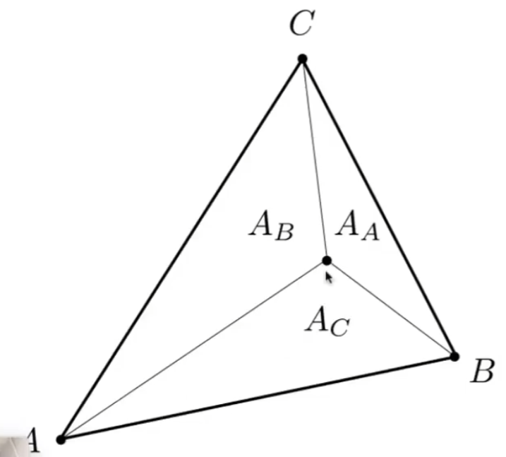

# 计算机图形学入门

## 线性代数
1. 行列式通常可以看做是n维的向量围成的超立方体的超体积
2. 至于矩阵乘法C=AxB，往往可以看作是：
   1. 矩阵C的每个元素：矩阵A的行向量对矩阵B的列向量的dot product
   2. 矩阵C：矩阵A的列向量受到矩阵B的每一列的每一个数的线性加权求得的结果
## 变换矩阵
3. ABv叠加变换的时候从右结合向左结合，顺序重要
4. 2*2矩阵表示不了平移，毕竟结果中任意一个值都要有x或者y的，没有常数项。所以怎么可能有x+3这种东西。
5. 什么是Affine Transformation？什么是homogeneous coordinates？
   1. 用于应对：变换矩阵+平移加法用于处理平移和旋转/缩放比较丑的情况。希望能够使用一个变换矩阵处理两种情况。
   2. 方法：在矩阵最后添加一列$[offsetX,offseY,1]$，也加最后一行$[0,0,1]$这个样子。
   3. 这种变换方式叫做仿射变换（Affine Transformation，先线性变换再平移），这种增加一行一列的方式叫做齐次坐标。
6. 坐标系转换，就是：
   1. 找到转换前坐标轴o,x,y和对应的值;
   2. 找到转换后坐标轴e,u,v和对应的值;
   3. 让转换后的e、u、v用转换前的oxy表示，将这些矩阵相乘，也就找到了转换矩阵。 
      1. 类似于p=(u_p,v_p)=e+u_{p}u+v_{p}v，所以这里就是一个缩放+平移，两个矩阵就确定了
7. 之前介绍了如何确定世界空间的一系列点，现在从世界空间到屏幕空间的两个步骤也齐全了：
   1. 正交投影——从world space到canonical volume (space)
   2. 屏幕投影——从canonical volume到screen space
   3. 将两个矩阵相乘可以变换所有的坐标

## 光栅化
- [ ] 处理三角形共用边的方法没有理解
- [ ] 为什么behind eyes的三角形经过变换会变到视野的前方？
   1. 看来这和透视变换的特性有关，回去关注一下透视变换。
      1. 可能要从增加的那个行开始看起。
1. Clipping有两个方法，一个是包围盒，一个是齐次除法前
   - [ ] 所以齐次除法到底是什么？
   1. 就是由于透视变换需要一个跟z有关的分母（距离眼睛越远，东西的宽度就越小），而现有的以1为最后分量的齐次座标无法表示。所以为齐次座标最后一个分量引入了不为0的w，最终变换的结果点由所有分量/w得到
2. 过程：
   1. 基于三角形可以使用一个函数来判断某个点在三角形内还是外。
      1. 核心——叉乘可知点在直线的哪个方向，如果按照固定旋转方向取三角形的三个顶点中的两个，那么和 其中一个固定顺位的顶点与待测点构成的向量去叉积，得到的结果方向相同——点在三角形内部；否则在三角形外部
   2. 如果知道是在某个三角形的内部那就可以根据这个三角形的数据填色咯
3. 优化：
   1. 如果按照前述方法，每个像素都要和三角形做这样的处理，岂不是有一个三角形就要进行一次？所以这里可以给一个三角形的轴向包围盒，如果像素不在包围盒范围内可以不用进行该三角形的处理了
   2. 当然以上这种遇见窄长三角形还是旋转的就很难受，效率就很差
4. AABB包围盒——Axis-Aligned Bounding Box
   
## 光栅化2——走样系列
1. 采样
2. 傅里叶变换——时域、频域

## 着色
目的：解决深度问题
1. 画家算法
2. Z-Buffer
   1. 这个玩意存储了*每个像素*的深度信息
   2. 如果需要应用MSAA等反走样算法，那么Z-Buffer需要在每组采样点一个——否则每个像素在交线附近仍只有一个深度及颜色值说不过去啊

## 着色2
目的：高光渲染
### Blinn-Phong
1. 公式
   1. 基于原理是：视线向量和镜面反射向量重合越高越高光
   2. 根据前述，使用半程向量和法线的接近程度来代替视线和镜面反射向量的接近程度（Phong模型）
      1. 半程向量：视线和入射向量夹法线的那个角的角平分线方向
      2. 目的：估计是简化计算——这就是Blinn-Phong模型
   3. 最终公式仍然要加上多少能量*到达了被照射点*，以及颜色的反射差别k，即
   $$L_s = k_s(I/r^2)\max(0,\cos \alpha)^p\\=k_s(I/r^2)max(0,\mathbf{n}*\mathbf{h})^p$$.
      1. 其中$\alpha$即为半程向量和法线夹角
      2. $p$是一个容忍度，控制高光有多大，即让随角度增大反光程度快速下降。一般是100-200
2. 环境光
   1. 环境光和观测方向以及光照方向都无关。就给一个常数就行了
3. 最终的式子
   $$L = L_a+L_d+L_s \\ =k_aI_a+k_d(I/r^2)\max(0,\mathbf{n}*\mathbf{l})+k_s(I/r^2)\max(0,n*h)^p$$

### 着色频率
#### 三种方式
1. 三角形做一个法线——Flat Shading
2. 每个顶点做一个法线——Gouraud Shading
   1. 如何知道顶点的法线方向？
      1. 共顶点的几个三角形的法线方向求平均
3. 每个像素做一个法线——Phong Shading（前面那个是模型，后面这个是着色方法）
   1. 如何知道像素的法线方向？
      1. 根据顶点法线和重心坐标插值
#### 选择
1. 几何复杂的情况下，着色模型可以用简单的，但如果特别密集，那么Flat会很难受

### 渲染管线
1. 从Application到Vertex（投影到屏幕上）到Triangle Processing（形成三角形）到Rasterization（采样形成离散的fragments）到Fragment Processing（Z-buffer）
2. Shader 就是描述顶点或fragment要执行什么操作。
   1. 每个顶点或者fragment都会执行一次这个shader
   2. 顶点操作就叫vertex shader，像素着色器就叫pixel/fragment shader

### 纹理映射
#### 映射关系确定
1. 模型中三角形的顶点位置到纹理中的位置的映射由艺术家完成
2. 自动生成
   
总之我们不管
#### 纹理上的坐标系
1. 一般是UV坐标，不管纹理的形状如何，范围各自都在0-1范围之内
   1. UV坐标存储在3D模型之中。一般3D模型的顶点包含位置、UV、法线等等信息（但obj文件中可能只有位置）。
2. 一个模型可能由多个纹理像贴瓷砖一样构成，即同一个纹理可以平铺重用（这种就叫tilable texture）

## 着色3
### 纹理插值
问题：我们将纹理贴在模型上的时候，需要对三角形内部的像素进行纹理采样，由于我们只知道顶点和纹理上的坐标映射关系，所以这个过程我们需要进行插值。方法是重心坐标。
#### 重心坐标
特性：三角形内任意一点都可以表示为三角形顶点的线性组合
$$(x,y)=\alpha A+ \beta B+ \gamma C$$
满足
$$\alpha + \beta + \gamma = 1$$
（不满足则不共面）
$$\alpha,\beta,\gamma \text{  non-negtive}$$
（不满足则在三角形外）

1. 任一点的系数计算过程：
   1. $$\alpha = \frac{A_a}{A_A+A_B+A_C}$$
      $$\beta = \frac{A_B}{A_A+A_B+A_C}$$
      $$\gamma = \frac{A_B}{A_A+A_B+A_C}$$
   其中$A_A$, $B_B$, $C_C$分别为图中分割出的三角形的面积。
   1. 最终可以推出的公式相对要简单一些
2. 重心的三个系数都是$1/3$
3. 最终这个东西可以用来对三角形顶点的任意value进行线性组合，可以是颜色、*纹理坐标*、位置等等

4. 注意一个性质：重心坐标投影之后会发生改变。所以空间属性还是在三维空间做插值，平面属性在二维空间中做插值
   1. 这句话其实适用于我们非线性变换的透视投影，理解起来很简单，非线性变换之后点分直线或面积的比例关系将无法得到保证（如上图），所以得到的重心坐标的$\alpha, \beta, \gamma$就不正确从而就不能直接拿来用了。

#### 应用纹理
最简单的算法：根据屏幕像素中心坐标，采到对应物体的坐标，得到物体的UV，用UV在Texture上查找颜色并应用于该屏幕坐标即可。
1. 纹素（texel）：纹理上的一个像素
##### 存在的问题

1. 如果纹理太小了咋办？就是UV坐标不为整数，最后你用哪个颜色呢？
   1. 这个问题实际上就是“输入是非整数的值，但只有整数的数据，怎么取”的问题：
      1. Nearest：四舍五入到最近整数——格子化
      2. Bilinear：使用四个纹素，先在一个方向上线性插值变为两个点，然后再以这两个点在目标点处做线性插值得到最后一个点（比最近邻更少的锯齿）
      3. Bicubic：用16个插值（比双线性更少的锯齿）
2. 纹理太大了怎么办？会出现摩尔纹+狗牙：因为远处的像素覆盖的纹理范围极大，所以无法用中心坐标来代表整个范围内的*平均值*。所以解决这个问题的方法是——找到范围内的平均值。
   1. Supersampling！提高了采样率，好，但是很慢
   2. 好，我不在runtime提高采样率，我给原始数据做预处理（平均）——Mipmap（Mip comes from the Latin "multum in parvo" - a multitude in a small space）
      1. 即生成一系列（Level）的各轴分辨率缩小到一半的小图——只多了三分之一的存储量。
      2. 确定Mipmap的Level：
         1. 根据待查像素和其邻居坐标可以大致确定其在level0上的覆盖范围
         2. Level0上的覆盖范围l为2的D次方来确定Level为D的Mipmap，即$$D=\log_2L$$
      3. 艹，那这个$\log$之后的结果不渐变啊，如果我需要1.8层的咋弄嘞？
         1. 简单，层与层之间插值
            1. 分别在两层Mipmap之中分别插值
            2. 在Mipmap层间根据D再插一次
            3. 所以这种就叫Trilinear Interpolation
      4. 但是Mipmap会有三线性插值从而远处非常模糊的问题
         
         1. 原因：Mipmap只假设方形区域的图片，而严重变形的窄长范围很难处理（注意上图，各个长条形的区域实际上是平均了很大一片区域）
         
         1. 方案：Anisotropic Filtering（各向异性过滤），除了整个方形压缩，三线性过滤的预计算Ripmap还包括分别在两个轴上的压缩（上图）
         2. 代价：三倍额外存储
         3. 此外：$n*$的各项异性过滤就是最多采样到第$n$层

### 纹理的其他应用
> Modern GUPs, textures = memory + range query(filtering)

能够进行范围查找——滤波的数据
1. 纹理可以当作环境光使
   1. 可以记录在球面上
      1. 不是均匀描述
   2. 记录在立方体上——可以把球的texture扩到包围盒上，得到六张图
      1. 扭曲不是很厉害
      2. 但是需要dir->face computation
2. 纹理可以用来做凹凸贴图（任何不同位置的任何不·同的属性）
   1. 这个定义的是某个位置的*高度偏移*（好像runtime还是需要做点别的事情）
3. Displacement贴图更牛逼，它真正使得三角形顶点产生了位移，解决了凹凸贴图或者法线贴图的两个问题：
   1. 边缘会发现没有凹凸变化
   2. 物体自己特别突出的位置会投影到自己
   3. 但是它也有要求：
      1. 三角形要足够细，成本足够高
4. 三维的纹理
5. 自己投自己的阴影可以预计算后贴上
6. 体渲染，三维空间中的任意一点的某个value——这里纹理已经推广了

## 几何1
几何表达并非易事
### 分类
* 隐式的几何：空间中的点不会告诉你而是告诉你它们的关系：
  * 例子：
    * 代数方法：球方程
    * Constructive Solid Geometry（CSG）：通过一系列基本物体的运算(最典型的：布尔运算)来得到最终结果
    * DistanceFunctions：距离函数之间Blend
  * 优势：
    * 容易知道某个点在不在这里，但不容易枚举出每个点
    * 射线求交很简单
    * 简单几何体完全handle
    * 容易处理拓扑变化
  * 劣势：
    * 很难构建复杂形态
* 显式的几何：
  * 例子：
    * 点云
      * 需要特别密集的点
      * 点云到多边形有很多研究
    * 三角形或者其他多边形面
      * 连接关系表示也很多样
        * obj结构: v 坐标 vn 法线 vt 纹理坐标 f（face）v/vn/vt
    * Bezier Curve
      * 递归求解
      * 结果公式
  * 优势：容易枚举所有点，但是不容易知道某个点在不在这里

## 几何3
### Mesh Operations

1. Subdivision 让网格复杂
   1. Loop(人家叫Loop) Subdivision
      1. 增加三角形
      2. 新顶点根据各个附近的点的位置进行移位（上图）
      3. 旧顶点也需要做位置更新
   2. Catmull-Clark Subdivision (General Mesh)
      1. 奇异点
      2. 边中点连接面内点
      3. 更新位置
      4. 好像这个可以保持sharp的边
2. Simplification 让网格简化但仍然保持拓扑结构
   1. 层次结构的几何，就像Mipmap(层次结构的图像)
   2. 方法：Edge Collapse
      1. 将一个边坍缩掉变成一个点
      2. 选择边以及点位置的计算方式的准则是最小二次度量误差
3. Regularization 长短不定的三角形会给渲染带来一些问题，所以将三角形尽量等边而保持结构

## Shadow Mapping！

问题：这里是一个全局的问题，因为之前shading往往只对一个独立的点进行处理，一旦涉及到点与点之间的关系，比如阴影咋弄？

### 核心思路
如果一个点不在阴影里并且要被看到，那么这个点*一定会被light和Camera看到*

### 步骤
1. 从光源看向场景，做一个Z-Buffer的东西（shadow map），但是只记录最浅的深度（能照到的深度）
2. 从摄像机看某个点，反查这个点在之前shadow map之中的位置得到map中的深度
3. 比较这个点实际的深度和map中的深度，如果一致（各种方式）就可以被光源照到，就可以计算了

### 软阴影成因

光源是有大小的，所以有些对象区域是可以被部分光源照到，部分照不到的，完全照不到到完全照到的过渡就形成了软阴影。

## 问题
1. 说了半天，好像Phong shading之类不能直接处理物体自己的遮挡阴影——甚至好像都不能处理物体间的遮挡阴影！