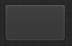
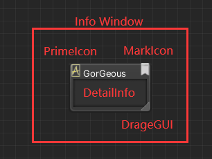
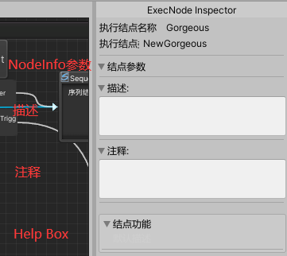

# 项目相关

## Graph
1. 如何打开？
   1. 从BlackJack-ProjectH-LogicGraphEditWindow-LogicGraphEditWindow

### 需求梳理
1. 重构动画状态机
<!-- todo -->
   - [ ] 没有看到“动画状态机”类型，什么是动画状态机？
1. 节点上显示参数
<!-- todo -->
   - [ ] 看看节点上都定制了什么参数
   - [ ] 具体显示逻辑是什么
4. 条件节点兼容环境变量判断
<!-- todo -->
   - [ ] 看看环境变量配置
5. 左侧菜单常驻，拖拽节点
<!-- todo -->
   - [ ] 调研一下ShaderGraph的表现形式？
6. 环境变量类似的常量配置机制
<!-- todo -->
   - [ ] 什么范围的常量？
   - [ ] 看看环境变量配置是什么
7. Override机制
<!-- todo -->
   - [ ] 可能类似于Prefab Variant？当前是可以复制之后再操作，但是之前的prefab和现在的并没有建立起联系，如果之前的修改能够用在现在这个上头就好了是吗？
   - [ ] 那么依赖的粒度是多大——节点？参数？还要保持backward compatibility。
8. 合理、人性化的端口操作、Debug功能
<!-- todo -->
   - [ ] 端口指的是什么？
   - [ ] ebug功能具体指的是什么？

 
   
### LogicGraphScriptableObject
1. 整个Json和Unity Serialization结合的流程  
     
   实际上和BJF中的`ConfigData`如出一辙，那个用`protobuf`生成了装有数据的bin文件，然后把bin文件全部写到SO的字段里（字节流）；这里把Json的字符串流全部写到SO字段里。
2. 似乎整个LogicGraph中的item都被分为以下几类，分别做了几个List
   1. 表示状态的item
   2. 表示可执行节点的item
   <!-- todo -->
   - [ ] 其实还有`EventFilterNode`，这个之后再看
      1. 这个是State之后执行Node的分支节点，见后文

### LogicGraphEditWindow
1. 画线归LG管

### ExecutableNode
1. NodeInfo和Node的关系如何？难道说NodeInfo是Editor中的数据，而Node是NodeInfo在运行运行的逻辑？
   1. 对，因为这里有一个ExecutableNodeFactory，需要在运行的时候传入info制造新的node并执行
2. 当前节点的实例化信息
<!-- todo -->
- [x] 状态和节点的关系是咋样嘛，哪个东西开始并驱动的节点的行为啊
   1. 好像是`EventFilterNode.OnEvent()`来触发的，也就是说State驱动的Filter、Filter驱动的ExecNode
1. `ENInfoEditor`和`ENInfo`的关系如何？
   1. OnGUI()绘制的时候拿到的东西是`4Editor`
   2. `4Editor`里头包含了一个`Info`
   3. `4Editor`里头的Info在右键菜单添加节点的时候（`OnExecNodeCreate()`）根据类型ID从工厂创建，然后还分配了`4Editor`中的`view`信息（位置、大小、名称）
      1. 这俩玩意里面没有两个ID，所有的ID都是同一个逻辑层ID

### CanvasDrawer
#### 节点控件
1. 节点的视觉元素  
     
   空结点  
     
   基类节点及视觉元素
2. 每一个Node都会对应一个Drawer，无论是class还是runtime。
   1. 但是会复用吗？好像不会
<!-- ? 插入节点时会有一个Debug.Log，这些Debug.log输出的格式以及时机是什么呢？ -->
3. 插入节点的`Debug.log()`
<!-- ? -->
4. 记录操作什么时候做呢？
<!-- ? -->
1. 妈的上下文到底是啥？
<!-- ? -->
6. 这个图的连接关系是有向的，那么实际存储呢，是双向的还是单向的？
<!-- ? -->
8. `GUIStyle`又是什么东西呀
<!-- ? -->
9. 两个节点能否连接的默认check实现居然是上下文里有没有结束节点？那看看别的好了
   1.  State里面貌似是只能允许一个，这个就很省事

### InspectorDrawer
1. inspector的视觉元素
     
   基类节点inspector，最上面是节点名字
<!-- ! -->
1. 无论实现哪个类的时候，都要注意参数！ 
  

------------------
### 实现Copy
<!-- #### Copy一个ExecutableNode和对应的drawer -->
就看SequenceNode吧
1. 发现了，`XXXImpl`的函数都是`virtual`，而`XXX`的原本函数则不是`virtual`的！学到了。
2. 在Editor中绘制一共要实现三个东西：
   1. NodeInfo  
   2. CanvasDrawer
   3. InspectorDrawer
   分别要进行NodeTypeDefine、CanvasTypeDefine和InspectorDefine
3. 