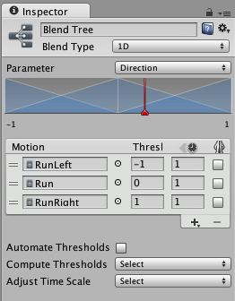

****# Unity Manual 问题和手记

## Timeline
## Animation窗口和Timeline窗口的差异
1. animation窗口一次就只能看一个clip
2. 两个玩意在播放的时候是冲突的
3. Timeline可以创建影片、音频序列、VFX等
4. >Animation 窗口提供了一种创建动画剪辑和为*单个游戏对象*设置动画的简单方法，而在其中创建的剪辑可以用 Animator Controller 进行组合和混合。但是，*要创建涉及许多不同游戏对象的更复杂序列*，应使用 Timeline 窗口。

## 时间轴工作流程
1. Timeline窗口create，会为对象新建Animator和TimelineDirector（貌似timeline必须）
2. TimelineDirector将动画资源和被控制的对象绑定，控制更新时间、启动播放等等（为啥这里还要有Animation的模块？）
3. 录像会成为无限剪辑
   1. 无法直接定位、修剪或拆分，因为这种剪辑没有定义大小，但是可以转换为Clip Track就可调整编辑了
4. 无限剪辑可以通过曲线编辑器或者动画编辑器窗口进行编辑
5. 动画之间的offset偏移和动画过渡也可以在轨道中进行处理
   1. 前者直接在后一个clip上“适配前一个偏移”

1. 上下身的动画遮罩也可以
   1. 通过Add Override Track，然后点击Track打开其属性，设置avatar mask即可 
   


## Timeline Editor窗口
1. 轨道渲染和动画优先级为自上而下，即第二个轨道的动画将覆盖第一个动画
2. Playable的track最骚了，它可以进行任何参数的根据时间->曲线变化的自定义控制。
   1. 他需要两个东西，一个是继承`PlayableBehaviour`，另一个是`PlayableAssets`。后者是一个SO，用于存储播放所用数据；前者是一个行为脚本，控制数据的变化。
      1. 似乎后者可以被附加到Track上，然后可以设置在Track上时各个数据的值，并将值传递至前者，从而履行行为。
      2. 后者通过CreatePlayable来跟前者的行为建立关系
      <!-- ? 为什么这些值的变化没有给到曲线编辑 -->
      3. 但这里有个问题，为什么我无法用曲线编辑来编辑那些properties，而只是一个fixed的值
   <!-- todo 这里记得理解一下 -->
3. *空白外推*概念，这玩意可以控制动画Clip前后的状态受Clip影响的情况
   1. None——使用场景中的状态，但这并不意味着除非手动设置Clip的特定入口动画的播放将完全割裂，因为这里有个叫“缓入”的东西
   2. Hold——保持最后一帧状态
   3. Loop——一直循环
   4. Ping Pong——和Loop的一直从开始到结束的循环不同，Ping Pong循环是先从前到后，然后从后到前
   5. Continue——根据Clip资源的设置而进行——如果Clip是loop则loop
4. *缓入*
   1. Ctrl+拖动clip开头或结尾来设置缓入和缓出，即即使只有一个clip，也可以设置clip和场景原始值的渐变
      1. 音频也可以

## Animation
   <!-- todo 似乎糖果给的动画和骨架可以导入为humanoid，待会可以试试Humanoid提供了什么优势 -->
### 导入相关

#### 导入Humanoid动画
1. 动机：Avatar动画可以利用Unity的Avatar支持，例如IK等
1. 动画导入Humanoid类型时，点击Apply之后Unity实际尝试解析了导入骨骼并尝试和Avatar系统进行匹配，这样才能用Unity内建的有效的Avatar系统的方便功能
2. 如果解析不成功，其实可以进行Avatar匹配，可以修正骨骼本身和Avatar系统的映射
     
   可以看到Avatar这套骨骼还是有很多东西的，虚线代表的是可选节点，实现代表的是必选节点


#### 事件 
[使用动画事件](https://docs.unity3d.com/cn/2018.4/Manual/animeditor-AnimationEvents.html)
1. 动机：向剪辑添加事件可以实现类似于在动画脚步踩在地上的时候播放脚步声的需求。
2. 选择待调用函数的时候，也可以传入四种参数之一：`int`、`float`、`string`、`Object`
3. 但是动画事件在inspector中直接能够调用的函数貌似也就是属于自己这个物件的函数了。看来这里需要一个事件系统

#### 动画剪辑的循环优化
1. 在某些特定的导入设置下（humanoid可），动画片段曲线会存在循环优化提示，告诉你你的动画在循环情况下的连接合理情况，然后你可以基于指示情况进行修正  
   

#### 根运动
1. >在动画中物体产生的位移，可以在运行时，让绑定了Animator组件的game object，也发生实际的位移。且这个位移，是根据播放动画中每一帧物体的位移，在 X 和 Z 轴上投影计算而得。    
   对于某些技能动画，整个动画是有一定位移的，但是动画的位移是动作设计师在设计时根据动作需要调出来的，位移是跟动作的幅度直接相关和匹配的。那么在释放技能的时候就只需要直接播放动画，只要应用这个 Root Motion 的特性，就可以很好的完成角色在播放动作的同时进行移动，动作播放完毕之后就在动画结束帧角色所在的位置。而不要额外地做计算工作。接下来看下animation clip inspector面板上若干和root motion有关的属性选项
   
   听起来应该就只有一个根动画是否开启的开关而已啊？为什么还有个Root Motion Node 的东西？
   1. >当导入的动画剪辑包含根运动时，Unity 会使用该运动来驱动正在播放动画的游戏对象的移动和旋转。**但是，有时可能需要手动选择动画文件层级视图中的其他特定节点作为根运动节点**。
   


### 动画状态机

#### Solo和Mute功能
1. 目的：状态机太复杂了只想调试其中一部分动画的播放情况，可以Mute掉一部分，或者仅Solo一部分

#### 目标匹配
<!-- todo 待会试试 -->
1. 目的：听起来可以在某个动画进度的时候令某个身体部位位于某个世界位置（听起来借由移动整个根物体而完成了动作的适配。）
2. 好像...有些动作游戏（AC？）就是在跳跃和目的地存在一定误差的时候直接平移到抓取点的...

#### 混合树
1. 动机：混合侧步跑动、前向跑动从而生成各个方向跑动的动画/混合走动和快速跑动从而生成各个速度的跑动动画
   >Transition中的混合只是在两个State转换时，在给定的时间内进行混合，避免动画切换过于突兀。而混合树中的混合，是时时刻刻进行不同程度的混合。
2. 注意：混合树的动画插值方式为线性插值，但根运动不是
##### 1D混合

1. 以上是三个动画混合的界面，很简单，每个动画都有一个**金字塔**，在塔尖所在的位置达到该动画的最大值

##### 2D混合
暂时不知道干啥用


## Cinemachine

### 入门
1. CM的基本逻辑：
   1. 基于多个虚拟摄像机来控制主摄像机的移动和LookAt
   2. 使用Timeline来进行时序控制和相机间过渡
2. 虚拟相机的基本逻辑分为`Follow`和`Look at`，两者分别由虚拟相机的`Body`和`Aim`属性控制
   
   1. `Aim`属性可以设置Dead Zone、Soft Zone和ScreenX/Y三类设置，分别在图上由红色、蓝色和黄色区域表示。这个后面可以澄清一下这三个区域

### Track & Dolly
1. 动机：改变`Body`的类型为`Tracked Dolly`后，可以添加路点轨迹来限制相机在轨迹上移动。
2. 添加路点轨迹是从Cinamachine-Create Dolly Camera with Track/Create Dolly Track with Cart
   <!-- todo 奇怪，cart到底干吗用 -->
   1. Cart的作用？
3. 然后将路点轨迹的transform赋值给虚拟相机即可

### State Driven Camera 
1. 动机：可以根据某个物件的Animator的状态，控制使用不同的虚拟相机。
   1. 例如进入Idle的时候可以使用正面相机来观察玩家当前形象。
2. 使用的东西就是一个`Cinemachine State Driven Camera`，并在其中设置注意的动画机对象
3. 在此基础上，设置每个动画机状态使用的VC即可
   
## 扩展编辑器

### 编辑器窗口

#### 显示窗口（EditorWindow）
1. 条件：
   1. 代码放置于Editor文件夹中（显示窗口需要，但是我用`EditorUtility.OpenFilePanel()`这种在MB的`OnEnable()`里就可以）
   2. 需要继承`EditorWindow`类
   3. 显示窗口的驱动力是
      ```CSharp
      [MenuItem("Window/Window Test")];
      public static void SomeWindowShowMethod() {}
      ```
   4. `OnGUI()`有实际的界面显示内容
      1. > The `OnGUI()` function gets called every frame as long as the containing script is enabled - just like the `Update()` function.
         1. 懂了，就是`GUI`的`Update`
         2. 但是它并不是真的每帧都调用更新的，不信输出log即可。只在focus的时候等更新。
2. 为什么填入的值不能修改？
   1. 要用类似这种形式去set the value back才行：
      ```CSharp
      value = EditorGUILayout.Slider(value, 0f, 1f);
      ```

#### Editor的UI（）
1. 这里提到了GUILayout，那么GUI和GUILayout的区别是什么呢？
   > `GUI` and `GUILayout` basically *do the same thing. All the controls that you create are identical in both*.  
   The difference is that with `GUI` you have to give an absolute location and size of your controls.  
   *With `GUILayout` you don't do that. Unity organizes the control positions automatically*. How Unity does this can be defined by methods like `GUILayout.BeginVertical`, `GUILayout.BeginHorizontal` and `GUILayout.BeginArea` (just to name the most common). Also you can set desired button sizes, etc.  
2. 然后Editor中的UI还提供了一些额外的仅用于编辑器的控件在`EditorGUI`中。
   1. 比如`FadeGroup`（不知道干啥用的），比如以下是fade group的半显示和全显示的效果：
       
   <!-- ?  -->
3. 为什么这里要使用前后夹的方式来写界面？

#### 属性绘制器（`PropertyDrawer`）
1. 有一些自定义的可以在Inspector中有显示的类，可以定制他在Inspector中的显示效果
2. 方法：
   1. 示例：
      ```csharp
      [CustomPropertyDrawer(typeof(Ingredient))] // 标记哪种类型的property需要重绘
      public class IngredientDrawer : PropertyDrawer // 继承property绘制器
      {
         // 在给定的矩形内绘制属性
         public override void OnGUI(Rect position, SerializedProperty property,GUIContent label)
         {
            // 在父属性上使用 BeginProperty/EndProperty 意味着
            // 预制件重写逻辑作用于整个属性。
            EditorGUI.BeginProperty(position, label, property);
            var subProperty = property.FindPropertyRelative("subProperty"); 
            EditorGUI.EndProperty();
         }

         // 在这个函数中定义需要的高度
         public override float GetPropertyHeight(SerializedProperty property, GUIContent label)
         {
            // 逻辑
         }
      }
      ```
   2. 番外：在这个东西的基础上，我们可以利用属性的特性来控制`OnGUI()`的绘制逻辑，在前面的扩展`PropertyDrawer`类的基础上，可以不对其加入property的特性，而是加入特性的`[CustomPropertyDrawer(typeof(MyXXXAttribute))]`，在任意`property`存在`MyXXXAttribute`的时候才调用这个代理进行绘制；以及对不同参数设定不同的绘制模式
      1. 如果在`OnGUI()`中需要解析定义的`MyRangeAttribute`中的内容时，`OnGUI()`必须有这么一句，拿到父类中的特性字段
         ```CSharp
         MyRangeAttribute range = (MyRangeAttribute)attribute;
         ```
         1. 这里因为由`CustomPropertyDrawer`制定了特用于某个Attribute，所以可以直接获取对应的attribute而不会因为定义了多个attribute而get不到对应的。
3. 注意，`EditorGUILayout`由于性能原因不能用于`PropertyDrawer`（估计动态适配的话属性太多）

#### 自定义编辑器（）
1. 动机：之前的自定义逻辑适用于Property，而这次的则直接适用于某个`Monobehaviour`
2. 修改Inspector中显示的方法：
   1. 首先继承**`Editor`**类，还有`CustomEditor`特性
   2. 然后把逻辑放到`OnInspectorGUI()`中
      ```CSharp
      [CustomEditor(typeof(LookAtPoint))] // 注意打上标记
      [CanEditMultipleObjects]
      public class LookAtPointEditor : Editor // 注意继承
      {
          SerializedProperty lookAtPoint; // 用于缓存property
          void OnEnable()
          {
              lookAtPoint = serializedObject.FindProperty("lookAtPoint"); // 从这里可以根据名字get到property
          }
          public override void OnInspectorGUI()
          {
              serializedObject.Update(); //? 更新property的representation
              EditorGUILayout.PropertyField(lookAtPoint); // 显示property，看来这里可以自适应
              serializedObject.ApplyModifiedProperties(); // 应用属性的修改
          }
      }
      ```
3. 修改Scene视图中显示的方法：
   1. 逻辑在`OnSceneGUI()`中
   2. 主要基于`Handles`类中的场景控件
      ```CSharp
      public void OnSceneGUI()
      {
         var t = (target as LookAtPoint);

         EditorGUI.BeginChangeCheck();
         Vector3 pos = Handles.PositionHandle(t.lookAtPoint, Quaternion.identity);
         if (EditorGUI.EndChangeCheck())
         {
            Undo.RecordObject(target, "Move point");
            t.lookAtPoint = pos;
            t.Update();
         }
      }
      ```

#### 如何在标题栏加入padlock
[来源](http://leahayes.co.uk/2013/04/30/adding-the-little-padlock-button-to-your-editorwindow.html)  
```csharp
   private void ShowButton(Rect position)
   {
      if (this.lockButtonStyle == null) {
         this.lockButtonStyle = "IN LockButton";
      }
      this.locked = GUI.Toggle(position, this.locked, GUIContent.none, this.lockButtonStyle);
   }

   void IHasCustomMenu.AddItemsToMenu(GenericMenu menu)
   {
     menu.AddItem(new GUIContent("Lock"), this.locked, () => {
         this.locked = !this.locked;
     });
   }
```

### APIs
#### EditorUtility
提供了一些Editor层面的实用工具:
##### Dirty系列
当你想要修改一个object但是并不想设置一个`Undo`可以使用`SetDirty(Object)`。


#### Editor.Undo
当你在某个东西进行需要一个undo操作的**修改**时，可以用这个。
以下是一些使用范例：
修改一个property
```csharp
Undo.RecordObject (myGameObject.transform, "Zero Transform Position");
myGameObject.transform.position = Vector3.zero;
```
添加组件
```csharp
Undo.AddComponent<RigidBody>(myGameObject);
```
新建新的GameObject或者摧毁：
```csharp
var go = new GameObject();
Undo.RegisterCreatedObjectUndo (go, "Created go"); //? 奇怪这里先创建再记录

Undo.DestroyObjectImmediate (myGameObject);
```
改变parent
```csharp
Undo.SetTransformParent (myGameObject.transform, newTransformParent, "Set new parent");
```

#### GUILayout

#### GUILayoutUtility
1. `GetLastRect()`只能在`Repaint`事件的时候拿到正确的rect


## 问题
1. 我如何切到那些`Component`的源码而非仅仅是metadata文件？毕竟在Editor中是有这个Component的源码的。
   1. 首先想先看看是不是直接修改那些package源码有效，至少两种情况下生效：
      1. package文件在外部
      2. package文件在项目下Package文件夹
      3. 以上情况都通过load package from disk引入了包
   2. 更多问题：工程下的package、系统盘cache的package、项目下的package，都是什么，并且关系是什么
   3. F12进入的meta文件是什么，在哪里的？
   4. 使用VS的时候能够进入toggle，下方输出：
      > PdbNavigator: Searching for 'UnityEngine.UI.Toggle' type sources in E:\test_projects\unity\UITestOnlyOpenByVS\Library\ScriptAssemblies\UnityEngine.UI.pdb
      1. 有点意思啊，看看pdb的相关内容
2. 什么是“非线性剪辑”
   1. 看什么是线性剪辑：过去磁带机的剪辑方式即是需要从不同此带合成到同一盘磁带
   2. 似乎磁带的播放方式是连续线性的，而且剪辑的方式是破坏性的——电影底片需要被剪断。而现在，组合可以是树形的，非破坏性的，随机读写的
   <!-- ? -->
3. 奇怪，humanoid动画会有位移（会位移到000）
   <!-- ? -->
4. 此外，为什么两位动画师给我的动画都可以humanoid，但是默认文档里却推荐使用generic
5. 一直以来的问题，为什么`Start()`和`Update()`并非`override`的。
   1. 找到了一个[讨论](https://forum.unity.com/threads/solved-start-and-update-methods-do-we-override-them-hide-them-or-what.404044/)
      1. 这个讨论中更为主导性的老哥猜测这里有某种magic，至少应该是通过reflection去找到了那个函数，而后通过某种方式进行的调用。总之不是正经路数。目的是为了**避免虚函数调用的消耗**。

## 想法
1. 导入的资源文件的在Unity层的配置应该全都是在.meta文件中的
   1. 比如我今天修改了导入动画的类型——Generic还是Humanoid，git中的修改全在meta中

## 脚本
### 脚本序列化

#### 热重载
1. 热重载即修改并保存代码直接应用，用到热重载的部分即在修改之前保存当前所有可序列化的数据，然后在热重载后恢复它们
   <!-- ? -->
   1. 如何检测变化的字段呢？靠名称？
2. 热重载时序列化**包括私有变量的所有变量**，即使没有`SerializedField`。此外，**静态变量绝对不会恢复**。

#### 序列化规则
1. 字段修饰：
   1. 非`static`
   2. 非`const`
   3. 非`readonly`
   <!-- 4.  -->
   4. 为什么这些静态的不能序列化，是不必？热重载的时候会不会被析构和重新构建？还是不能？
2. 字段类型：
   1. 简单
      1. 非抽象/**非泛型**的Serializable class
      2. Serializable struct
      3. `UnityEngine.Object`派生对象的引用
      4. 原始数据类型
      5. 枚举类型
      6. Unity的**某些**内置类型：
         1. Vector：`Vector2`、`Vector3`、`Vector4`、`Rect`、`Quaternion`、`Matrix4x4`、`Color`、`Color32`
         2. 一个数：`LayerMask`
         3. 别的奇怪东西：`AnimationCurve`、`Gradient`、`RectOffset`、`GUIStyle`
   2. 容器：
      1. 所有以上的简单字段类型组成的数组
      2. 所有以上简单字段类型的`List<T>`
3. 注意：Unity不支持多级嵌套容器序列化，解决方案有2：
   1. 将嵌套类型包装在类或结构中
   2. `ISerializationCallbackReceiver`执行自定义序列化

#### 序列化的意外行为
##### 不同字段引用相同对象时的行为
对于多个不同字段引用相同的自定义对象，Unity**不会序列化成图，而是序列化成树**（妈的）。具体来说是该对象的数据将Copy在两个引用者之内。但是派生自`UnityEngine.Object`不受此影响  

1. 测试过了，定义了一个可序列化的类型并让两个脚本引用之，在进入游戏中inspector修改这个引用对象的字段，另一个脚本也可以显示变化。然后更改了一下脚本进入热重载，修改则不会同步显示了！
2. 此处这种行为被称为“**内联序列化**”，

##### 自包含的类型（且成员有`null`）序列化
```csharp
class Test : MonoBehaviour
{
    public Trouble t;
}
[Serializable]
class Trouble
{
   public Trouble t1;
   public Trouble t2;
   public Trouble t3;
}
```
以上反序列化最多会有**7**层，也就是申请可能$3^7$次内存。因为序列化程序对某个对象进行序列化**并且该对象的该字段为null，则Unity就会申请新的对象**。

##### 不支持多态 
如果`public Animal[] animals`运行时存储了`Dog`、`Cat`和`Giraffe`，在序列化之后你就会只剩三个`Animal`了。
原因实际上是因为“内联序列化”，也就是序列化的内存数据布局必须要提前知晓，这也就决定了这个东西的序列化必然是“编译期”、“静态”的序列化。
1. 测试过了：在成员中加入了`public Animal[] animals`，存储了一个`Animal`和`Dog`，使用`Dog d = animals[1] as Dog`，热重载之后在`OnEnable()`中对`d`进行判断已经为空
<!-- ? -->
2. 但是为什么`Monobehaviour`或者`SO`就可以正常被序列化呢？

#### 序列化的使用建议
1. 使用最小数据集，避免序列化缓存数据——保持backwards compatibility
2. 避免嵌套和递归结构，仅引用`UnityEngine.Object`派生类对象

#### 额外内容
1. Unity的基础类型的继承结构
     
   [图源](https://blog.csdn.net/zhaohuaonline/article/details/71272245)
2. 脚本中的事件listener除非是在Editor中赋值的，否则不会被序列化，也即是Instantiate之后新的物体的listener会丢失


### 插件
#### 如何导入外部dll
[来源](https://docs.unity3d.com/Manual/UsingDLL.html)
直接把生成好的dll拖到项目中作为asset就行了
1. 为什么这里的dll没有intellisense？  
   用Debug模式生成就好了。