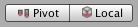

# UnityUI


## User Interface
1. 看样子Unity有三种UI套件：
   * UIToolkit，也就是UIElement：就是像web的那种UI，具体用在哪里我也不知道
   * Unity UI：基于GameObject的runtime UI系统
   * Immediate Mode UI：GUI、GUILayout、EditorGUI、EditorGUILayout那些，code-driven的UI系统（https://blog.unity.com/technology/going-deep-with-imgui-and-editor-customization）
2. 具体的IMGUI和Retained的区别在上文中有介绍，Retained GUI是保存了数值信息的（新建的slider你不用也可以拖拽并且显示值）。而IMGUI则不会保存，想想Slider的函数签名
   ```csharp
   public static float HorizontalSlider(float value, float leftValue, float rightValue, params GUILayoutOption[] options);
   ```
   它不仅会返回值也需要输入值，亦即每帧刷新的时候都会重绘并找你要值。
### Canvas
1. 这个玩意的边界显示是为了即使在没有打开Game View的时候也能进行编辑
2. 使用`EventSystem` object去处理消息（所以`EventSystem`和UI能够联合的机制是什么？）
3. UI元素的遮挡关系取决于hierarchy中出现的顺序，越往下越前。当然可以通过SetSibling系列函数去改变。
4. 三种Render Mode分别是Screen Space - Overlay/Camera和WorldSpace，分别意味着各种变换/后处理等跟着分辨率走/跟着相机走/谁也不跟

### Basic Layout



1. pivot显示出来后旋转则以它为圆心


2. Rect Transform可以分为两个部分：
   1. 和原始Transform一致的部分：Pos、Rot、Scale
   2. 进阶的比较好理解的部分：Width、Height
   3. 进阶的新概念：Anchors和Pivot
3. Resizing不会改变子物体的比例，而Scaling则上下一起
   
#### Pivot
设置了Pivot并在pivot状态之中，Rot、Scaling、Resizing操作都会以Pivot为圆心
1. Rot好理解，后两者意为向Pivot所在位置缩放，也就是左边和右边边界的缩放速度是不同的。比如pivot偏右，则右侧的边界向pivot缩进的速度会慢一些，而左侧的边界向pivot缩进会快一些。
   
#### Anchors
不同于Pivot是在自己的缩放中起作用，Anchors则可以定义具有`RectTransform`的父物体缩放对子物体产生的影响行为。
1. 影响产生的逻辑是：
   1. 每个Anchors角标和子物体的对应Rect角点的距离保持不变。
   2. Anchors的位置值是“在父物体的位置比例来定义”
2. Anchors在inspector中的设置逻辑是Min代表左下角的坐标，Max代表右上角的坐标。
3. 并且这里有特殊的对Pos的影响情形：
   > When all the anchor handles are together the fields displayed are **Pos X, Pos Y, Width and Height.** The Pos X and Pos Y values indicate the position of the pivot relative to the anchors.
   When the anchors are separated the fields can change partially or completely to **Left, Right, Top and Bottom**. These fields define the padding inside the rectangle defined by the anchors. The Left and Right fields are used if the anchors are separated horizontally and the Top and Bottom fields are used if they are separated vertically.
   1. 哪组Anchors并在一起，那个方向就是Pos，代表pivot离那一组anchors的距离。否则就是Tom、Bottom，**代表锚点矩形各个边相对与父物体边界的距离？？？？**
   2. **疑问：为什么需要这样？**
4. **疑问：为什么改变pivot，image的位置也会改变，并且只改变一个方向**
   
### Visual Components
1. Image的Simle、Tiled、Filled都能理解，Sliced看不出来差别
2. Mask使用是在父物体上加入Mask Component，而不是直接创建Sprite Mask物品，然后子物体即会受这个Mask的影响

### Interaction Components
1. **所有可交互的组件的交互原理是什么？`EventSystem`是如何支持它的**
2. Scrollbar和content内容范围的自适应原理是什么，即ScrollView如何实现的
   1. 表面上：ScrollView包含一到两个Scrollbar，以及一个带有Mask的Viewport，它的下方是可以变换大小的content范围。随着content的变大Scrollbar的滚动范围可以自适应之
   2. 整个Component结构是
      1. Scroll Rect （看来是需要一个东西来统御其下组件）
         1. Masked View
            1. Content
         2. Horizontal Scrollbar 
         3. Vertical Scrollbar

#### DropDown
DropDown也有玄机：本身包含一个未激活的生成下拉列表item的Template，该template实际是一个Scroll View并在Content中放入了一个Toggle。在实际运行中会根据这个Template创建一个Content以及Content之下的多个Toggles即Item，自动由Scroll Rect管理。有趣有趣。
1. 所以DropDown实际可以看成按钮激活的Scroll View，并且View的Content是一组数量不等的Toggles
2. 所以其实框架里的生成物品的template然后再生成物品是很可以理解的了
3. 至于实现中的逻辑是：
   ```csharp
   if(dropDownButton("默认显示"))
   {
      var gm = new GenericMenu();
      gm.AddItem("OptionA",
         ()=>{} // OnClick逻辑
      );
      gm.AddItem("OptionB",
         ()=>{} // OnClick逻辑
      );
      // ...
   }
   ```

### Auto Layout
1. Animation可以用到Button类似的控件上，原因只是Button暴露了一些状态的Trigger给你设置，在具体发生那些事件的时候会通知同级的Animator应该。
2. Layout Element设置了三组size，分别是minimum、preferred、flexible，在有空间的时候依次使用。
3. 而Layout Controller类目下的ContentSizeFitter则可以一键设置水平和垂直的size。至于Aspect Ratio Fitter，则仅管比例而不管实际大小
4. Layout Groups则可以视作是控制子物体的Layout Controller，分为Horizontal、Vertical以及Grid Layout Group
5. 问题：以上以绝对值控制的玩意如果父物体发生变化了咋办
   > Since a layout controller in the auto layout system can automatically control the sizes and placement of certain UI elements, those sizes and positions **should not be manually edited at the same time through the Inspector or Scene View**. Such changed values would just get **reset by the layout controller on the next layout calculation anyway**.
6. 关于Calculation肯定有很多要说的：
   1. minimum,preferred and flexible宽度和高度是从下到上计算的，也就是先计算儿子再调整父亲并计算（？难道这仨不是看自己之外有没有地儿？）哦，就是计算Element的的时候是自下而上。
   2. 而以上三个值的有效值是自上而下？哦，Controller要计算使用Element中的哪个值的时候是自上而下。
   3. 并且，以上两步先把宽度的做完，然后才会把高度的做完。
   4. 当组件需要重新构建布局的时候，可以调用`MarkLayoutForRebuild()`，这个函数会在当前帧结束、渲染之前执行。

### Event System
1. > Input modules are designed to be extended or modified based on the input systems that you wish to support. **Their purpose is to map hardware specific input (such as touch, joystick, mouse, motion controller) into events that are sent via the messaging system.**
2. 事件系统能做：
   1. 指定一个target，给其上**所有的实现了某个接口的组件**，发送一个东西，并调用该接口的函数。这个过程由以下函数执行：
      ```csharp
      public static bool Execute<T>(GameObject target, EventSystems.BaseEventData eventData, EventFunction<T> functor);
      ```
      1. eventData只有两个信息——bool类型的used和当前eventSystem以及当前选中的物件
      2. 至于functor的形式则是
         ```csharp
         public delegate void EventFunction<T1>(T1 handler, BaseEventData eventData);
         ```
         其参数就是当前的target上的“那个接口”和传递的数据
3. 经过一阵查看+揣摩大致明白了，其实需求就是：我晃悠鼠标+点击按键->能够激活对应的UI的相关事件。而从解耦的角度考虑，UI本身理应对input是没有概念的，所以这里需要一个Event System去做中介，将各类输入设备的各种状态和行为处理后，根据情形去调用UI的相关事件。
   
   1. 那再具体一些，这里需要对Input的设备有所了解，对于逻辑不同的input要有不同的处理（比如touch pad和mouse就显然有一些不同，touch pad没有左右键这种东西），所以这里有`Input Modules`来支持这种“business logic”的区分定义。
   2. 然后Input Modules到UI组件的通知过程就是由`Event System`来给到底层支持的
   3. 至于我需要通知哪个对象，这个根据输入状态检测对象的功能是由`Raycasters`提供的
   4. 最终就是调用UI组件的东西了


### How tos
1. 如何让UI适应屏幕
   1. 让UI的锚点在它所在的角上
   2. `Canvas Scalar`可以设置`Canvas`保持布局随屏幕缩放
      1. 默认`Canvas`的缩放是取决于宽度的，宽度变为1.5倍则UI物件也会变为1.5。想分配一下宽高的权重，就在设置好“随屏幕缩放”之后设置Match，0.5就是一半一半了
   
### APIs
#### GUI类
1. [`GUI.Window()`](https://docs.unity3d.com/ScriptReference/GUI.Window.html)会创建一个window，其中需要传入一个用于绘制该window的内容的函数。
   1. 这个函数为什么在`EditorWindow`扩展类`OnGUI()`函数中无效？
      > `EditorWindow.Begin`/`EndWindows` is used to determine where these can go. You need to have all calls to `GUI.Window` or `GUILayout.Window` inside a `BeginWindows` / `EndWindows` pair.[来源](https://docs.unity3d.com/ScriptReference/EditorWindow.BeginWindows.html)
      1. 以上情形在使用`GUILayout.Window()`时也适用
2. [`GUI.DragWindow()`](https://docs.unity3d.com/ScriptReference/GUI.Window.html)直接在WindowFunction内部调用可以让这个Window是dragable的
#### 一些跟GUI相关的东西
1. `UnityEngine.GUIContent`用于指定显示内容，包括`string text`、`Texture image`和`string tooltip`（就这仨）。
2. `UnityEngine.GUIStyle`用于指定单个UnityGUI控件的外观。（和前面那个看来有联系了）
   >This works closely in relation with `GUIStyle`. `GUIContent` defines what to render and `GUIStyle` defines how to render it.  
3. `UnityEngine.GUISkin`则是当你在整个GUI中需要一个统一的风格时，它可以负责

#### GUIUtility
显然是GUI的实用工具，提供了以下一些功能：


#### Event类
用户输入或者UI事件。  
每次有一个Event的时候，`OnGUI`都会调用一次，所以`OnGUI`可能会一帧刷新多次。([`Event API`](https://docs.unity3d.com/ScriptReference/Event.html)&[Unity调用顺序](https://docs.unity3d.com/Manual/ExecutionOrder.html))
  
(一次从非焦点到焦点的`Event.current.type`的变化以及变化发生的帧数，注意其中最直接的mouseDown和mouseUP)  
1. `repaint`每帧一次，`Layout`为初始化事件，会收集信息并进行自动布局
2. 事件的类型Drag和MouseDown不会在同一次Event事件中
3. GUI的一些类型例如Button可能会把Event给吃掉


#### 各类Event的触发情况
1. `Drop`事件在鼠标存在`Drag`的时候才会触发，鼠标没有移动的时候不会触发
2. 即使当鼠标脱离按键`PointerUp`也会触发
3. `OnSelect`会在当前控件成为热点的时候触发，`OnDeselect`会在当前控件热点消失（选中空白/别的控件）时激活
   1. `OnDeselect`调用顺序先于`OnSelect`
4. `OnClick`在玩家`PointerDown`和`PointerUp`同一个对象的时候会触发，无论点击时长如何


# `RectTransform`的`Anchor presets`
三种模式：
1. 默认模式：设置Anchor在父物体上的位置
2. Shift - Pivot模式：同时设置Pivot吸附到对应边角
3. Alt - Pos模式：同时使物体所在位置也吸附到对应边角
同时要注意编辑的时候是否还存在别的`ILayoutSelfController`或者`ILayoutGroup`之类，存在以上接口的组件可能会影响当前RectTransform的尺寸调整。